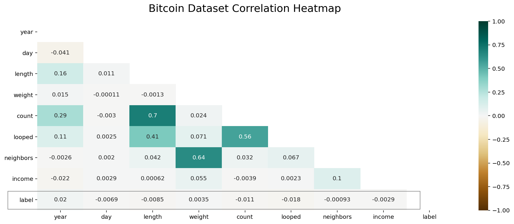
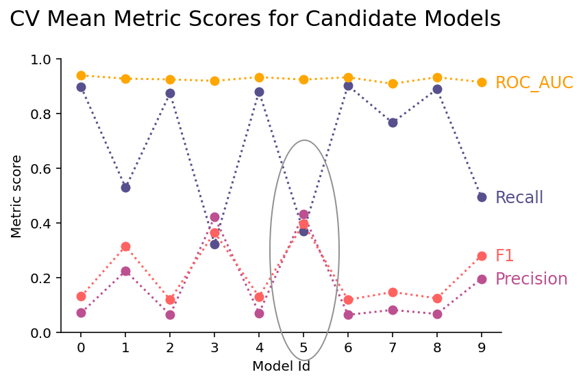
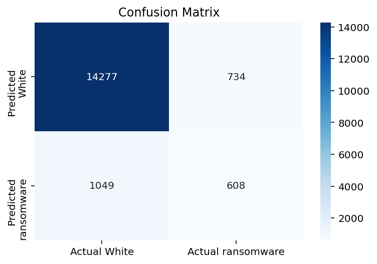
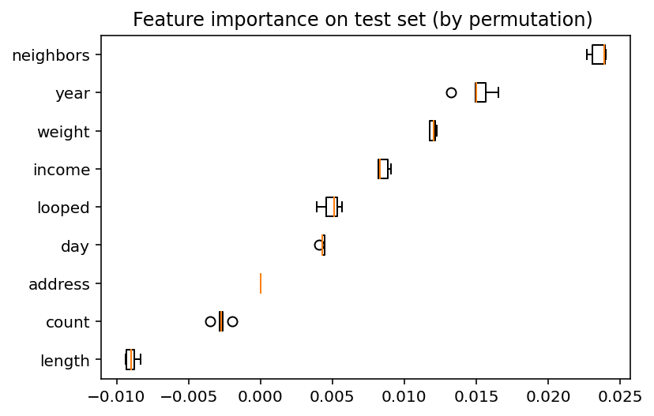

# Oh gosh! Is that a bitcoin heist?

Skills showcased: 

*   Scikit-Learn Pipeline to automate preprocessing and model training. 
*   Model selection & tuning with grid search

## Introduction

Ransomware is a type of malicious software that locks up a user’s computer system until a ransom is paid, a virtual heist if you will. Payments are often demanded through Bitcoin, an anonymous currency. 

But not all is lost! Bitcoin transactions are public and permanently stored – this leaves plenty of data for a machine learning intervention.

 *Queue hopeful music*

Hence, my research prompt: can I use machine learning to tell whether a ransomware was behind a bitcoin transaction?

## About the data

I used this [dataset](https://archive.ics.uci.edu/ml/datasets/BitcoinHeistRansomwareAddressDataset) contributed to the UCI Machine Learning Repository.

The data contains bitcoin transactions above a certain threshold amount collected over a 24 hour period. 

I’ve taken some steps to simplify the data I will working with:

*   Turned multiclass target labels into binary ones: white or ransomware. 
*   Sampled only 20% of the original data, amounting to 570k instances. (Otherwise training models would choke my computer). 

## EDA

Right off the bat, I saw something less than desirable. Feature variables were all minimally correlated with the target variable, _label_. Nevermind that, the project’s gotta go on.

Additionally, the dataset was quite imbalanced, offering a great opportunity to experiment with various sampling techniques. 

<table>
  <tr>
   <td>
   </td>
   <td>Count
   </td>
   <td>Proportion
   </td>
  </tr>
  <tr>
   <td>White (encoding=0)
   </td>
   <td>575,056
   </td>
   <td>98.6%
   </td>
  </tr>
  <tr>
   <td>Ransomware (encoding=1)
   </td>
   <td>8,282
   </td>
   <td>1.4%
   </td>
  </tr>
</table>

Lastly, there were quite a few right skewed features, but a quick log transformation did the job.

## Preprocessing

The preprocessing pipeline (built with scikit-learn) was kept nice and simple, as the data was already quite clean. Here are the steps:

1. **Data imputation.** Missing categorical values were replaced with the string ‘Missing’ , and missing numeric ones were replaced with an anomalously large number -99999. This method works poorly for regression models, but I let it slide because my focus was on tree models and there weren’t actually any null data.
2. **Log transformation.** I defined a custom function class using FunctionTransfomer.
3. **Standardardization.** Enables faster training and higher accuracy on regression models.

## Model Selection & Tuning

I divided this stage into two steps. This was needed due to limited computation power. Since the dataset was **highly imbalanced**, I thought models likely needed some form of resampling to perform well. However, resampling techniques, such as SMOTE, are often time-consuming. Hence, I can only afford to try it on a select few candidate models, along with their optimal hyperparameters. 

### Evaluation Metrics

The classic quartet: **F1, ROC/AUC, precision, recall** were used. 

Here’s what recall & precision meant in the context of my dataset:

*   Recall: of the true ransomeware accounts, how many did the model identify.
*   Precision: of the ransomware accounts the model has identified, how many were actually true.

This task required a fine balance between precision and recall. On the one hand, we don't want to falsely predict many white accounts as ransomeware; this would damage trust. But on the other hand, we don't want to miss too many ransomware accounts; this would negate the point of crime monitoring. 

Hence, on top of examining precision/recall individually, F1 and ROC/AUC provide a more balanced overview of the model's performance.

### Step 1: Random Grid Search

In this step, I executed random grid search on hyperparameters for 3 types of models:

*   **Logistic Regression**
*   **Random Forest**
*   **Extra Tree Forest **

**20 random model searches**, coupled with 5-fold cross validation, were conducted, amounting to a total of 100 model trainings. 

The top 5 models were determined using the models’ mean rankings. These were then fed into step 2 for further tuning.

### Step 2: Parameter Grid Search

The top 5 candidate models were then exhaustively searched against an upsampling technique, **SMOTE**, and a downsampling technique, **Random Under Sampler**, using parameter grid search. This amounted to 10 different models.

Evident in the metrics chart, the old rivalry between precision and recall is alive and well. I either got very good recall in exchange for terrible precision, or I got mediocre recall for mediocre precision. Overall, this suggested considerable overlap between the distributions of white and ransomware accounts. 

After balancing out rankings for each metrics, model 5 came out as the winner!

## Final model testing

This what my final model pipeline looked like:

1. Data preprocessing
2. SMOTE to artificially create more minority class in the training set
3. RandomForestClassifier(min_samples_leaf=7, n_estimators=30)

And the test set results:

<table>
  <tr>
   <td><strong>Metric</strong>
   </td>
   <td><strong>Score</strong>
   </td>
  </tr>
  <tr>
   <td>Recall
   </td>
   <td>0.37
   </td>
  </tr>
  <tr>
   <td>Precision
   </td>
   <td>0.45
   </td>
  </tr>
  <tr>
   <td>F1
   </td>
   <td>0.41
   </td>
  </tr>
  <tr>
   <td>ROC/AUC
   </td>
   <td>0.92
   </td>
  </tr>
</table>

The model performed pretty much within expectations. The F1 score clearly demonstrated the tradeoff between precision and recall. This is further evidence that white and ransomware transactions have strongly overlapping characteristics.

In terms of feature importance, the permutation test deemed neighbors to be the most important. Surprisingly two of the researcher-defined features used to profile transaction behaviors, length and count, showed negative impact to model performance. 

## Summary

Working with real-world data is, no doubt, hard. Despite making hyperparameter adjustments to ensure model generality, my final model was only able to achieve a mediocre F1 score of 0.41. A possible future step would be to explore deep learning models, which would make better use of the large data size; after all, I only used 20% of given data for this project.
