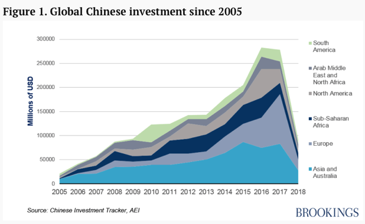
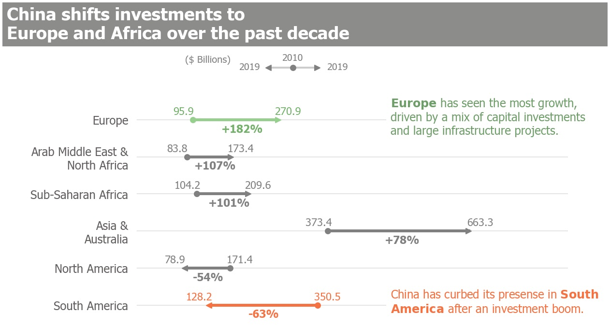
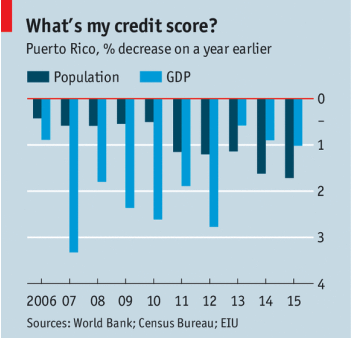
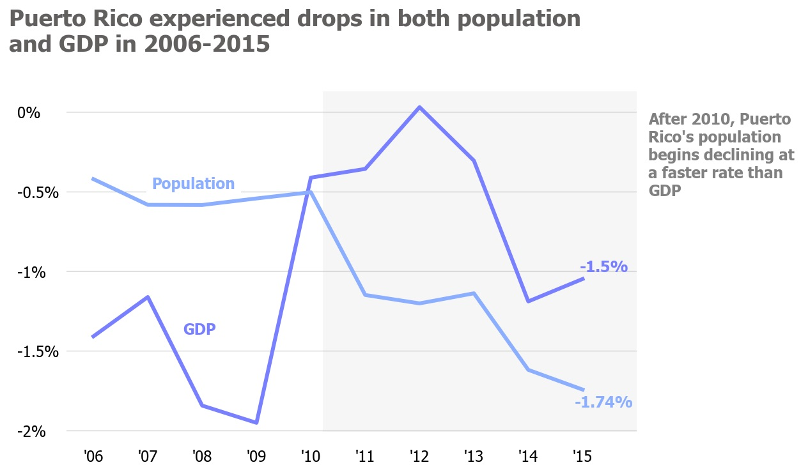

```python
# import all required library
import pandas as pd
import numpy as np
import matplotlib.pyplot as plt
import matplotlib as mpl
from matplotlib import colors, patches, rc
%config InlineBackend.figure_format = 'retina'
%matplotlib inline

mpl.rcParams['font.family']='sans-serif'
mpl.rcParams['font.sans-serif']=['Tahoma']
```

## Chart 1 - China's foreign investments

### Original:



### Redesigned version: 


### Rationale for changes:
A stacked area chart makes it difficult identify yearly changes for regions stacked above the bottom one. In addition, it provides more information than neccesary. I chose to single out investment volumes for the beginning and end of a time span (a decade), so that viewers can better understand how China's has shifted its investment focus.
My chart is a akin to a bar chart, where arrows are used to indicate growth changes.


```python
df = pd.read_csv('data/china_fdi.csv')
print('China FDI dataset dimensions:', df.shape)
```

    China FDI dataset dimensions: (3443, 21)


```python
def map_region(region):
    '''function that groups related regions together'''
    if region == 'USA':
        return 'North America'
    elif region in ['East Asia', 'West Asia', 'Australia']:
        return 'Asia & Australia'
    else:
        return region.replace('and', '&')

```


```python
# simplify region naming
df['agg_region'] = df.region.apply(map_region)

# summarized yearly fdi total by region
fdi_yr_region = df.groupby(['year', 'agg_region']).quantity.sum().reset_index()
```


```python
def autolabel(rects, values, color, left=False, middle=False, rects2=False):
    """
    Attach a text label above each bar displaying its height
    """
    cnt = 0
    color = ['#74b06b'] + ['grey'] * 4 + ['#f57242']
    for i, rect in enumerate(reversed(rects)):
        width = rect.get_width()
        height = rect.get_height()   
        if middle:
            width2 = rects2[-(i+1)].get_width()
            
            ax.text((width + width2)/2 - 30, 
                    rect.get_y()-0.3, f'{values[i]:<+,.0f}%', 
                    color=color[i], fontsize=11, ha='left',
                    fontstyle='italic', fontweight='bold')
        elif left:
            ax.text(width-20, rect.get_y()+0.18,  f'{values[i]:,}', 
                    ha='center', color=color[i], fontsize=11)
#             -len(f'${values[i]:,}B')*12
        else:
            ax.text(width+20, rect.get_y()+0.18,  f'{values[i]:,}', 
                    ha='center', color=color[i], fontsize=11)


# assign variable for plotting
region = fdi_yr_region.agg_region.unique()[::-1]

y_start = fdi_yr_region[fdi_yr_region.year == 2010].quantity[::-1] / 100
y_end = fdi_yr_region[fdi_yr_region.year == 2019].quantity[::-1] / 100
perc_change = np.round((y_end.values-y_start.values)/y_start.values * 100)

pairs = list(map((lambda tu: (min(tu[0:2]),max(tu[0:2]), tu[2:])), zip(y_start, y_end, perc_change, region)))

pairs = sorted(pairs, key=lambda x: x[2][0])
a,b, perc_region = zip(*pairs)
c,region = zip(*perc_region)
a,b,c = np.array(a), np.array(b), np.array(c)

perc_region = sorted(perc_region, key=lambda x : x[0])
perc_change, region = zip(*perc_region)
region = list(map(lambda x : x.replace(' & ',' &\n'), region))

```


```python
fig, ax = plt.subplots(1,1, figsize=(8,5))

main_color = 'grey'
hide_color = 'white'
axis_color = '#b5b5b5'
color = ['#97cf8f'] + ['grey'] * 4 + ['#f57242']

line_width = 0.08
x = np.linspace(0,5,6)
ax.hlines(x, a, b, lw=3, color=color[::-1], zorder=3)
ax.scatter(b[5]*0.994,[5], marker='>', zorder=10, color='#97cf8f', s=30)
ax.scatter(b[2:5]*0.994,[2,3,4], marker='>', zorder=10, color=main_color, s=30)
ax.scatter(a[5]*0.994,[5], marker='o', zorder=10, color='#97cf8f', s=30)
ax.scatter(a[2:5]*0.994,[2,3,4], marker='o', zorder=10, color=main_color, s=30)
ax.scatter(a[0],[0], marker='<', zorder=10, color='#f57242', s=30)
ax.scatter(a[1],[1], marker='<', zorder=10, color='grey', s=30)
ax.scatter(b[0],[0], marker='o', zorder=10, color='#f57242', s=30)
ax.scatter(b[1],[1], marker='o', zorder=10, color='grey', s=30)

end = ax.barh(x, b, color=hide_color, height=line_width, zorder=0)
start = ax.barh(x, a, color=hide_color, height=line_width, zorder=0)

# adjust axis alignment
ax.set_yticks(np.linspace(0,5,6))
ax.set_yticklabels(region, fontsize=12, fontweight='regular', color='#61605e')
ax.yaxis.set_tick_params(length=5, color='white')
ax.set_xlim(-20,max(y_end)+200)

# hide all axis/spines
ax.spines['left'].set_color('white')
ax.spines['right'].set_visible(False)
ax.spines['top'].set_visible(False)
ax.spines['bottom'].set_visible(False)
ax.get_xaxis().set_visible(False)

ax.grid(alpha=0.4)

# add bar labels
autolabel(start, list(a[::-1]), 'black', left=True)
autolabel(end, list(b[::-1]), 'black')
autolabel(end, list(c[::-1]), 'black', middle=True, rects2=start)

# set title
ax.set_title('China shifts investments to \nEurope and Africa over the past decade' + ' '*50 , 
             loc='left', fontsize=18, pad= 45, color='white', fontweight='semibold', x=-0.3, y=0.9, 
             backgroundcolor='#8c8c89')
# ax.text(-0.104,0.88,'($ Billions)',fontsize=13, color='#61605e'
#         ,transform=fig.transFigure)

# annotations
euro_anotation = r"$\bf{Europe}$" + ''' has seen the most growth, 
driven by a mix of capital investments 
and large infrastructure projects.'''

lac_anotation = 'China has curbed its presense in ' + r"$\bf{South\ }$" + \
'\n'+ r"$\bf{America\ }$" + 'after an investment boom.'

ax.text(500,4.6,euro_anotation,fontsize=12, backgroundcolor='white', color = '#709e6a')

ax.text(500,-0.2,lac_anotation,fontsize=12, backgroundcolor='white', color = '#f57242')

# legend
w=150
h=0.4
ax.hlines(6+h, w+100, w+200, lw=2, color='grey', zorder=3, linestyles='-', alpha=0.4)
ax.scatter(w+150,6+h,marker='o', s=30, color='grey', zorder=3, )
ax.scatter(w+100,6+h,marker='<', s=30, color='grey', zorder=3)
ax.scatter(w+200,6+h,marker='>', s=30, color='grey', zorder=3)
ax.text(w-70,6.15+h,'($ Billions)',fontsize=10, color = 'grey')
ax.text(w+40,5.95+h,'2019',fontsize=10, color = 'grey')
ax.text(w+220,5.95+h,'2019',fontsize=10, color = 'grey')
ax.text(w+150,6.2+h,'2010',fontsize=10, color = 'grey',ha='center')


plt.show()


```

## Chart 2 - Puerto Rico's population and GDP growth rate
### Original:



### Redesigned version:


### Rationale for changes:
The biggest change was transitioning from bar to line, because it afforded a much better view of the yearly trends. The side-by-side bars in the Economist's chart broke up the continuitiy of each category, making it difficult to compare yearly changes. My version also contained an enclosure chart to highlight portions referenced in the annotation


```python
# population
pop = pd.read_csv('data/population.csv')

pop = pop[pop['Country Name'] == 'Puerto Rico']
pr_pop = pop.iloc[:, 1:-1].T 
pr_pop.columns = ['Population']
pr_pop.index = pr_pop.index.astype('int')

pr_pop = pr_pop.pct_change()[-14:-4] * 100


# gdp
gdp_rate = pd.read_csv('data/gdp_rate.csv')
gdp = gdp_rate[gdp_rate['Country Name'] == 'Puerto Rico']
pr_gdp = gdp.iloc[:, 1:-1].T 
pr_gdp.columns = ['GDP']
pr_gdp.index = pr_gdp.index.astype('int')
pr_gdp = pr_gdp[-14:-4]

# gpd per capital
data = [[2006, 22936, 4.45],
[2007, 23665, 3.18],
[2008, 24898, 5.21],
[2009, 25769, 3.50],
[2010, 26436, 2.59],
[2011, 27279, 3.19],
[2012, 27945, 2.44],
[2013, 28513, 2.03],
[2014, 28981, 1.64],
[2015, 29763, 2.70]]
gdpc = pd.DataFrame(data, columns=['year', 'gdp_capita','gdp_capita_rate'])

```


```python
fig, ax = plt.subplots(1,1, figsize=(8,5))

c1 = '#7980FF'
c2 = '#8CAEFF'
ax.plot(pr_gdp.index, pr_gdp, color=c1, lw=3)
ax.plot(pr_pop.index, pr_pop, color=c2, lw=3)
# ax.plot(gdpc.year, gdpc.gdp_capita/1000, color='red', lw=3)


#reset axis
ax.set_xticks(pr_gdp.index)
ax.set_xticklabels(pr_gdp.index.map(lambda x: "'" +str(x)[2:]), fontsize=12)
ax.xaxis.set_tick_params(length=5
                        ,color='w')

ax.set_xlim(2005.5, 2016)

# ax.yaxis.tick_right()
ax.yaxis.set_tick_params(length=35, color='white')
ax.set_yticks([0,-0.5, -1,-1.5, -2])
ax.set_yticklabels(np.array(['0%','-0.5%', '-1%','-1.5%', '-2%']), fontsize=12, ha='left')

# hide axis/spines
ax.spines['top'].set_visible(False)
ax.spines['right'].set_visible(False)
ax.spines['left'].set_visible(False)
ax.spines['bottom'].set_visible(False)

# add gridlines
ax.grid(axis='y', lw=0.6, alpha=0.7)

# add text 
ax.text(0.15,0.72,'Population', transform=ax.transAxes, color=c2
       ,fontsize=12, fontweight='bold', backgroundcolor='w')
ax.text(0.89,0.09,'-1.74%', transform=ax.transAxes, color=c2
       ,fontsize=12, fontweight='bold',)

ax.text(0.205,0.3,'GDP', transform=ax.transAxes, color=c1
       ,fontsize=12, fontweight='bold',backgroundcolor='w')
ax.text(0.9,0.48,'-1.5%', transform=ax.transAxes, color=c1
       ,fontsize=12, fontweight='bold',)

annotation = '''After 2010, Puerto 
Rico\'s '''+ 'population' + \
'''
begins declining at 
a faster rate than 
'''+'GDP'

ax.text(1.02,0.7,annotation, transform=ax.transAxes, color='grey'
       ,fontsize=12, fontweight='bold',backgroundcolor='w')
# draw enclosure box
rect = patches.Rectangle((0.45,0.02), 0.6,1,linewidth=0,edgecolor=None,facecolor='grey', alpha=0.07
                        ,transform=ax.transAxes)
ax.add_patch(rect)

#set title
ax.set_title('Puerto Rico experienced drops in both population \nand GDP in 2006-2015' , 
             loc='left', fontsize=18, pad= 45, color='#61605e', fontweight='semibold', x=-0.1, y=0.95)
plt.show()

```
